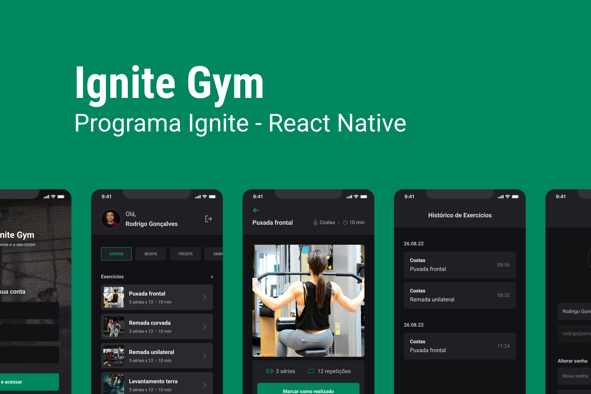

# :iphone: App - Ignite Gym

- Project developed in module 3 - Of **React Native** from **Ignite** from [Rocketseat][rocketseat_site].

## :computer: About

This project aims to create a virtual personal trainer that encourages the user to do gym exercises. It allows you to include the weekly training routine, manage and control progress in each series, the app has animations and descriptions that help you understand the exercise.

## :wrench: Concepts

- States
- Context API
- API consumption
- image manipulation
- Forms
- Navigation
- State immutability
- Lists and keys in React Native
- Properties
- Componentization

## :art: Layout



## :open_file_folder: How it works

### Pre-requisites
Before you begin, you will need to have the following tools installed on your machine: [Git] (https://git-scm.com), [Node.js] (https://nodejs.org/en/). In addition, it is good to have an editor to work with the code like [VSCode] (https://code.visualstudio.com/)

#### 🎲 Running the Backend (server)

```bash

# Clone this repository
$ git clone git@github.com:rodrigorgtic/ignitegym-api.git

# Access the project folder cmd/terminal
$ cd ignitegym-api

# install the dependencies
$ npm install

# Run the application in development mode
$ npm run dev

# The server will start at port: 3333 - go to http://localhost:3333

```

#### 🧭 Running the web application (Mobile)

```bash

# Clone this repository
$ git clone https://github.com/exodogurgel/ignite-gym-rn.git

# Access the project folder in your terminal
$ cd ignite-gym-rn

# Install the dependencies
$ npm install

# Run the application in development mode
$ expo start

# Use ExpoGo to run the App

```

## 🛠 Tech Stack

This project was developed with the following technologies:

- [React Native][reactnative]
- [Expo][expo]
- [Expo File System][expo-file-system]
- [TypeScript][typescript]
- [Native Base][native-base]
- [Axios][axios]
- [React Hook Form][react-hook-form]
- [Yup][yup]


## 🦸 Author

<a href="https://blog.rocketseat.com.br/author/exodo/">
  
 <br />
 <sub><b>Êxodo Gurgel</b></sub></a> <a href="https://blog.rocketseat.com.br/author/exodo/" title="Rocketseat"></a> 🚀
 <br />

[](https://www.linkedin.com/in/exodo-gurgel/) 
[](mailto:exodowellis@gmail.com)

---

## 📝 License

This project is under the license [MIT](./LICENSE).

Made with ❤️ by Êxodo Gurgel 👋🏽 [Get in Touch!](Https://www.linkedin.com/in/exodo-gurgel/)

---